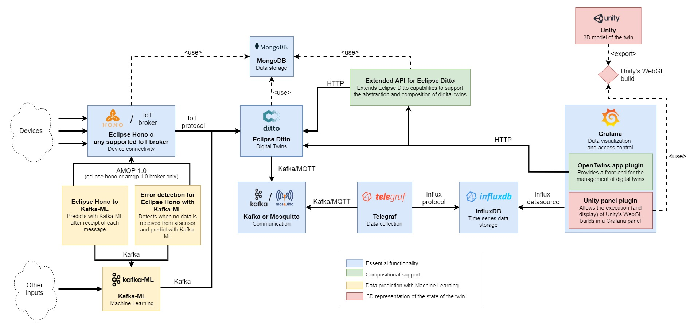

# Architecture

OpenTwins is built on a **microservices architecture**, designed to enhance scalability, flexibility and efficiency in the development, extension, deployment and maintenance of the platform. All the components that make up this architecture are encapsulated in [Docker](https://www.docker.com/) containers, ideally managed through [Kubernetes](https://kubernetes.io/), which ensures efficient portability and management. 

:::note

Although it is possible to deploy and connect the different components without containerization, this approach is not recommended due to the difficulties involved in terms of installation and management. However, it is important to note that OpenTwins could be [manually connected](../installation/manual-deploy/core.md#steps-to-connect) to non-containerized components, such as a local instance of Grafana.

:::

The following image illustrates the current architecture of OpenTwins, in which each color of the boxes represents the functionality covered by each component. Most of these components are external projects to our organization, however, we also include certain services specifically designed to enrich the functionality of the platform. Both the code and documentation of the [components](https://github.com/ertis-research/opentwins/tree/main/components) are available in their respective repositories.

### Essential functionality

The elements highlighted in **blue** form the heart of OpenTwins, as they provide the **essential functionalities** of a digital twin development platform: the definition of digital twins, the connection to IoT devices, the storage of information and the user-friendly visualisation of data. The tools used in this case include:
  - [Eclipse Ditto](https://www.eclipse.org/ditto/). This is **the core component of OpenTwins**, an open-source framework for digital twins developed by the [Eclipse Foundation](https://www.eclipse.org/). Eclipse Ditto provides an asbstract entity ["Thing"](https://eclipse.dev/ditto/basic-thing.html), which allows describing digital twins through JSON schemas that include both static and dynamic data of the entity. The framework stores the current state of the "Thing" entity and facilitates its [connection](https://eclipse.dev/ditto/basic-connections.html) to input and output data sources through various IoT protocols. In a typical scenario, the Thing entity will update its information via a source connection, generating events that are sent to the indicated target connections. In addition, the tool provides an [API](https://eclipse.dev/ditto/http-api-doc.html) that allows querying the current state of the entity and managing its schema and connections.
  - [Eclipse Hono](https://www.eclipse.org/hono/). This component facilitates the **reception of data through various IoT protocols** and centralizes it into a single endpoint, either [AMQP 1.0](https://www.amqp.org/) or [Kafka](https://kafka.apache.org/). This output connects directly to Eclipse Ditto, eliminating the need for users to manually connect to an external broker to extract data. This allows the platform to receive data through the most common IoT protocols, giving devices the flexibility to connect to the most appropriate protocol for their particular case.  

  :::warning

  Despite its advantages, we have observed that **Eclipse Hono does not scale correctly when the message frequency is high**, so we do not recommend its use in these cases. For this reason, or if it is not necessary to offer different input protocols, you can choose to connect Eclipse Ditto to one or more specific messaging brokers, such as [Mosquitto](https://mosquitto.org/) or [RabbitMQ](https://www.rabbitmq.com/).

  :::
  - [MongoDB](https://www.mongodb.com/). This tool is the **internal database used by Eclipse Hono and Eclipse Ditto**. Eclipse Ditto stores data about the current state of digital twins ("things"), policies, connections and recent events, while Eclipse Hono stores information about defined devices and groups.
  
  - [InfluxDB](https://www.influxdata.com/products/influxdb-overview/). This database provides an optimized architecture for time series, which guarantees superior performance in **storing and querying digital twin data**. Its high scalability and simplicity of use allow it to efficiently handle large volumes of data, facilitating the integration and analysis of information in real time. In addition, it is one of the most popular options in the field of the Internet of Things (IoT), generating an active community that consolidates its position as a robust solution.

  - [Telegraf](https://www.influxdata.com/time-series-platform/telegraf/). This is the recommended data collector for InfluxDB databases. It is in charge of constantly consuming the given Kafka topic and writing the received messages to the specified InfluxDB database.

  - [Apache Kafka](https://kafka.apache.org/) or [Eclipse Mosquitto](https://mosquitto.org/). It works as an intermediary between Eclipse Ditto and Telegraf, as they cannot connect directly (they need a component that acts as a broker).

  - [Grafana](https://grafana.com/oss/grafana/).

## Compositional support 

  - [Digital Twins plugin for Grafana](https://github.com/ertis-research/digital-twins-plugin-for-Grafana/).
  - [Extended API for Eclipse Ditto](https://github.com/ertis-research/extended-api-for-Eclipse-Ditto/).

## Data prediction with machine learning
The **yellow part**...

## 3D representation
The **red part**...